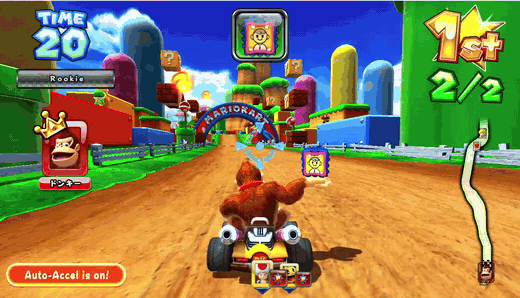
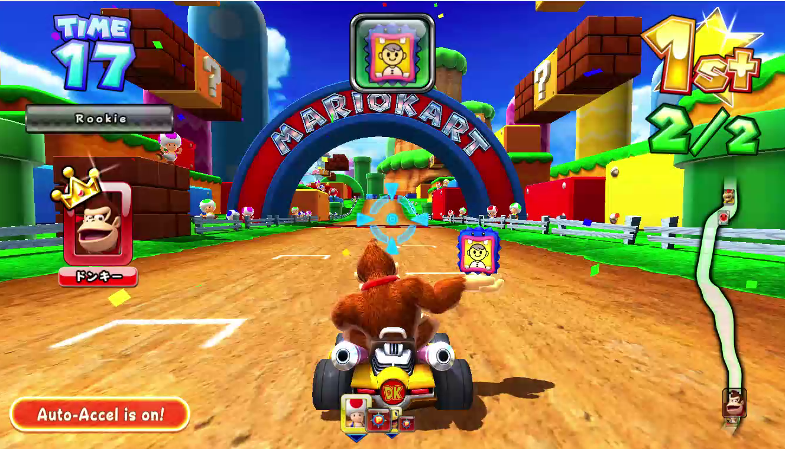

# mariokartdx-systemes3-recomp

**Mario Kart Arcade GP DX (Namco / Nintendo, 2013) — a System ES3 kart racer,
statically recompiled from its Win32 executable to native C.**

A cabinet with a wheel, a camera in the roof that photographs you and puts your
face on your kart, a card reader that remembers you, and a network that no
longer answers. Underneath all of that it is a Visual Studio 2010 application
running on a desktop PC, which is exactly the kind of thing a static
recompiler should be good at.

Built on [**systemes3recomp**](https://github.com/sp00nznet/systemes3recomp),
the Namco System ES3 recompilation toolkit, vendored here as a git submodule.

> **No game data here.** No executable, no `Data\`, no DLLs, no certificates.
> The `.gitignore` refuses all of it. Bring a game tree you can already read;
> the recompiled C is output you generate.



*The final lap of a race played on a gamepad, recompiled. Donkey Kong, lap
2/2, first place — and the finish. Not a demo loop: the steering, the item
and the coin are a real pad, and the race was won against the game's own AI.*



*The same run, a frame earlier. Attract mode used to be as far as this got;
the card prompt that stood in for a screenshot for months is now just
something you skip on the way to picking a character.*


## Why this target

Not because it is easy — it is the first ES3 title anyone has taken apart — but
because it is the one with a control group. Four separate builds exist,
spanning 2013 to 2022, and a change that works against one and not another is a
change that was fitted to a binary rather than to the platform. See
[docs/versions.md](docs/versions.md).

## Status

```
$ py -3.11 -m tools pe MK_AGP3_FINAL_v1.00.32.exe
format     PE32 i386
image      0x00400000 .. 0x0081cd7c
entry      0x007cb996
code       0x00401000 + 0x41bd7c
linker     MSVC 10.00   built 2013-04-23 12:10:51 UTC
sections   .text .rdata .data .rsrc .reloc
imports    495 functions from 27 DLLs
  needs    MSVCR100.dll         180
  needs    KERNEL32.dll          94
  needs    USER32.dll            60
  needs    WS2_32.dll            29
  needs    d3dx10_43.dll         16
  needs    eOkaoDt.dll           13   <- OMRON OKAO Vision - face detection
  needs    d3dx9_43.dll          11
  needs    eOkaoPt.dll           10   <- OMRON OKAO Vision - facial parts
  needs    WINHTTP.dll           10
  ...
```

| | |
|---|---|
| Target build | **v1.00.32**, the 2013 Japanese release — the smallest and the only unmodified one of the four |
| PE parsing | **Works** on all four builds |
| Functions recovered | **25,757** — the binary is stripped, so these are recovered by recursive descent, not read |
| Functions lifted | **29,645**, into 75 translation units. Not one failed outright. More than the catalog holds, because the driver closes every address the *generated text* dispatches to — a fall-through past a clamped extent, an arm of a jump table — round after round until nothing is left open |
| Instruction coverage | **Complete for every path this game takes.** The three it stopped on this round were `cvtps2pd`, `fldln2` and `fyl2x`, each hidden behind the last, and all of them went upstream into pcrecomp along with the rest of the x87 transcendental set |
| Imports | **495 of 495** resolved against real DLLs when run from a game tree — the OKAO Vision camera and `JVSEmuMK.dll` ship with the game, so the cabinet's own libraries answer for themselves |
| Board imports | **40** — the OKAO Vision camera, entirely by ordinal |
| Builds | **Yes** — every translation unit to a native executable |
| Boots | **Yes, all the way through.** The JVS-injection entry stub, the CRT, every C++ static initialiser, a twenty-thread worker pool, a real `mkart3` window, Direct3D 10 and a DXGI swap chain, DirectInput 8 — and then the cabinet's own startup: drive unit, I/O board, NAMCAM, steering, IC card reader, local network, ALL.Net authentication. **No error filed in any of the five slots** |
| Renders | **Attract mode, in full 3D — but not yet reliably.** 1360x768, 1,015,463 of 1,044,480 pixels lit, the course and karts and characters drawn and animating, the clock counting down. Measured since: about **one run in five** gets there. The rest blip out partway through the self-check and drop to the operator menu, or quit cleanly with exit 0. That intermittency is the top of the list, and the screenshot above is a real frame from a real run, not a representative one |
| Plays | Not yet. Attract mode is a demo the game drives itself; the wheel, pedal and coin path is the JVS I/O board, and nothing has been asked of it in anger |

### The hard part is not the CPU

It is worth being clear about where the work actually is, because it is not
where a console recomp's is.

The host **is** the machine. A System ES3 is an Intel desktop running Windows;
this is x86-32 code that wants kernel32 and Direct3D, and the computer you
build on has both. `systemes3recomp` forwards the import call to the real
function — `CreateFileW` is answered by `CreateFileW` — so roughly 455 of the
495 imports need no work at all.

What is left is the cabinet:

| | imports | |
|---|---:|---|
| `eOkao*.dll` ×5 | 40 | OMRON OKAO Vision — the camera in the roof. Face detection, facial parts, age and gender estimation. Imported **purely by ordinal**, documented nowhere, and the DLLs exist nowhere but in a game tree. |
| JVS I/O | via `DeviceIoControl` | Coins, wheel, pedals, item button, service and test. The `v1.06.35` build reaches it through `JVSEmuMK.dll!engate` instead, which is the clearest look at the interface we have. |
| `bngrw.dll` | 11 (v1.18+) | The Bandai Namco card reader. Progress, licence and kart to a magnetic card. |
| `Nbam_QR_Code.dll` | 6 (v1.18+) | The QR code printed on that card. Pure computation — the easiest of these. |
| AMCUS / Mucha | — | Network authentication, over stock WinHTTP to servers that are gone. Forwarded, and it fails the way an unplugged cabinet failed. |

**None of these are stubbed**, and that is deliberate. A handler that returns 0
lets the game past the call and breaks it somewhere else an hour later; a
handler that aborts naming itself is the to-do list in the order the game wants
it. See [systemes3recomp's docs/board-io.md](https://github.com/sp00nznet/systemes3recomp/blob/main/docs/board-io.md).

### It renders

```
[shot] frame 2500 -> es3_frame_2500.bmp  1360x768, 229140 of 1044480 pixels are not black (21%)
```

The recompiled game draws. Read out of the swap chain's own back buffer, not
photographed off a window: a rounded red panel with a gradient and a white
border, the game's outlined display font, **"Please call an attendant."** in
Mario Kart yellow, error lines beneath it, `CREDIT(S) 00 / 02` in one corner
and `MK3 Rev.1.00.32` in the other. Earlier in the boot it draws its
**"NOW LOADING"** spinner. Every shader, the font, the 2D pipeline, the
Direct3D 10 device and the swap chain: working.

Getting there meant answering the cabinet, one piece at a time, each found by
following the frame loop's own refusal to tick its tasks:

| what the game asked | where | answered with |
|---|---|---|
| how many I/O boards are on the USB bus | `0x007A8590` | one (`es3_bind_guest`) |
| a twelve-character cabinet ID | `[obj+0x498]`, checked at `0x005C1F8D` | `271000020001` - the format is fixed: `2710`, then the variant, then `02`, then the unit |
| the coin mechanism's state | `[0x009595C0]` | 2, "running" (`ES3_POKE`) |
| the I/O board's name | `[[0x9599F8]+0x2E8]`, `strcmp`d against `"NA-JV"` | `NA-JV` |

Each one, unanswered, parks a slot at `[[0x959B64]]+0x3C` in a mode whose flag
in the table at `0x00871A10` is 1; `0x005C38B0` sees that and the frame skips
`0x00746B90` entirely, so nothing updates, nothing is built and the back
buffer is presented untouched. That is the whole black screen, and the modes
walk 0x51 -> 0x52 -> 0x0D -> 0x0E -> 0x46 as each answer lets the next
question be asked.

### What is left: All.Net

The last one is not a cabinet part, it is a dead service. The game reported

> ERROR DNS TIMEOUT / TIP HOST NOT FOUND
> GAME CANNOT START UNTIL A NETWORK CONNECTION IS MADE

Behind that name is Sega's All.Net client - `alAbEx Ver 2.00.07`, statically
linked, rolling its own HTTP over raw WS2_32 - posting to
`http://naominet.jp/sys/servlet/PowerOn` and reading back `stat`, `uri`,
`host`, `name`, `nickname`, `region0`, `region_name0..3`, `place_id`,
`country`, `timezone` and a clock. Namco's own `amk3-stg.nbgi-amnet.jp` is the
second half, over WINHTTP.

`allnet.c` answers it where it asks: `gethostbyname()` returns 127.0.0.1 and a
listener on 127.0.0.1:80 replies to `/sys/servlet/PowerOn`. No hosts file, no
proxy, nothing off the loopback adapter. `ES3_NO_ALLNET` turns it off,
`ES3_ALLNET_PORT` moves it, `ES3_TRACE_NET` prints every request.

Two things about it are not the obvious thing, both measured. The FIRST name
the game resolves is its own hostname, from `gethostname()` at `0x006781BF`,
to learn the cabinet's IP - answering 127.0.0.1 to that turned `DNS TIMEOUT`
into `LOCAL NETWORK ERROR`, because the game concluded the cabinet was on
loopback. And the reply drains the request body before writing, because
closing a socket with unread data sends an RST and an RST discards the reply.

The DNS timeout is gone. What the screen says now is

> LOCAL NETWORK ERROR / ERROR AUTH NG
> NBLINE POINTS ARE AT 0 / PLEASE CHARGE

and the next measurement is the surprising one: **the All.Net client is never
asked**. `0x007B5470`, which picks between the PowerOn and DownloadOrder URLs,
does not run through frame 8000. No `connect()`, no `WinHttpConnect`, no
socket of any kind - with all of WS2_32 traced.

The local network check itself passes. `WSAStartup` succeeds at `0x00678A59`,
`SIO_GET_INTERFACE_LIST` at `0x00678382` finds a non-loopback interface and
leaves 172.19.0.1 in `[0x00952924]`, and the network init at `0x00678410`
returns 1 on its second call - the first returns 0 and `[0x0095291C]` counts
0xB4 frames down to the retry.

So the question is no longer what a server should answer. It is which gate
keeps the network manager from asking, and the candidate is `[0x0095A87C]` -
the manager object, allocated by `0x00675F20`, and every network branch in the
per-frame tick at `0x00678B20` is `cmp dword [0x95a87c], 0 / je`.

### The error panel is a list, and it is readable

The panel is not one error. `0x0071FDFD` walks five slots and prints the
first, reading each as `[[[0x00959B64]] + 0x3C + 4*i]` and indexing two tables
- `0x00932080` for the text, `0x00931EE8` for the code on the label. Read at
runtime with

    ES3_PEEK="959b64**+3c"

the five come back as `38 66 66 66 66`: one error, `0x66` being the "nothing
here" sentinel. 56 is **E05-55**, Shift-JIS for "network connection
incomplete" - so `LOCAL NETWORK ERROR`, `ERROR AUTH NG` and `NBLINE POINTS ARE
AT 0` are three lines of detail under a single condition, not three
conditions.

Blanked with `ES3_POKE="959b64**+3c=66"`, the next one surfaces: 70, **E08-01**,
"NamCam (camera) error" - the OKAO Vision camera board, which this machine
does not have either. Blank all five and the game leaves the panel and draws
its **operator test menu** - MENU (DRIVE UNIT), GAME OPTIONS, I/O TEST,
MONITOR TEST, SOUND TEST, NETWORK TEST, `MK3100-1-NA-MPRO-A32 (Rev.1.00.32)`,
and `<OFFLINE OPERATION>` along the bottom.

That is a poke, not a fix - but it says the gates are enumerable, that each
one is a named condition with an address, and that there is a real interactive
screen behind them.

And then, with the interface fix in and **nothing poked at all**, the same
screen arrives on its own: the game leaves the error panel and draws the
operator test menu. The runs that still showed the panel had `ES3_TRACE_NET`
set, and printing every UDP packet slowed the link worker enough to lose its
own race - the observer, not the observed. Turn the tracing off and the boot
gets there.

E05-55 comes from `L_006791C0`, which asks of each of five slots: is this slot
me - `[0x009253EC] == slot` - and if not, is it a connected peer? A cabinet
that has adopted a virtual adapter's address is neither.

### Following E05-55 back, with a debug register

`ES3_WATCH_MEM` was written for this and answered it in one run. Point it at
the error word - it takes the same chain syntax as `ES3_PEEK`, which matters
because the word is behind two pointers into the heap and is somewhere else
every run:

    ES3_WATCH_MEM="959b64**+3c"
    [watchmem] 0A32993C written at host 21A56373, in lifted 005C37E0

and `dispatch_owner()` names the lifted function. From there `ES3_WATCH_VA`,
which now sees direct calls, walked up the chain one run at a time:

| | |
|---|---|
| `0x005C37E0` | `AddError(code)` - scans the five slots at `[obj+0x3C]` and appends if the code is new |
| `0x005C2C50` | the generic raise-an-error wrapper; the code arrives as its argument |
| `0x005BF4D0` | **the decision.** `if (0x00679470() && [[0x00959B5C]+0xCDC] == 0) raise(0x38)` |
| `0x00679470` | true when `[0x0095A894]`, the All.Net client object, is null - or when `[0x0095A850]+0x94`, its status, is non-zero |
| `0x00679530` | creates that object, and runs only if `[0x00952914]` is set when `0x00678410` reaches `0x006785B6` |

So the panel is not about a server refusing to answer. It is about the client
object never being constructed - and about `[[0x00959B5C]+0xCDC]`, which is
the other way out of the `if` and reads non-zero exactly in the runs that
reach the operator menu instead. That is a race, not a configuration: two
runs with identical settings land differently.

### Open: text rows drawn on top of each other

On the operator menu and the error panel, some lines land on top of each
other, glyph by glyph - `REMAINING TE` over `REMAINING SERVICES:`,
`<OFFLINE OPERATION>` over `PLEASE WAIT.`, `TIME (UTC):` over
`MK3100-1-NA-MPRO-A32 (Rev.1.00.32)`, and on the error panel `LOCAL NETWORK
ERROR` over `ERROR AUTH NG`.

What is NOT wrong: the glyphs inside each string are spaced correctly, and
the menu list itself stacks correctly. So the font metrics are fine and the
row pitch is fine; it is the origin handed to some rows that repeats the
previous one.

It is not the operand-order trap that `fxch` was, either. Capstone reports
`fst`, `fstp`, `fld`, `fadd` and `faddp` with a single operand - only `fxch`
and the `fcmov`s carry the implicit `st(0)`, and this image contains no
`fcmov` at all. Checked, so the next person does not check it again.

### A correction, and a second gate

The frame loop's test is written up above as `0x005C38B0` returning true
meaning "skip the task tick". The polarity is the other way round. The code is

    006AB9D2  call 0x5c38b0
    006AB9D7  cmp  al, 1
    006AB9D9  je   0x6aba86      ; 1 SKIPS the tick; 0 falls through to it

and `0x005C38B0` returns 1 only when some slot holds a mode whose flag in the
table at `0x00871A10` is 1. With every slot at `0x66` it returns 0, which is
the running case.

And it is not the only gate. Immediately after it,

    006AB9E2  call 0x6ffcc0
    006AB9E7  cmp  byte [ebx + 5], 0
    006AB9EB  jne  0x6aba12      ; jumps PAST 0x00746B90

where `ebx` is the frame loop's argument - the task, from `[ebp+8]`, and the
caller at `0x006AA78D` checks `[eax+4]` the same way to skip the frame whole.
So `+4` and `+5` are that task's own "do not run me" flags, and they are set
while a system screen is up. Measured with every error slot at `0x66`:
`0x005C38B0` is called 84 times in one trail window and `0x00746B90` not once.

Which means forcing the tick is the wrong move: gameplay is paused on purpose
because the game is in test mode, and the way to attract mode is to leave that
screen.

### The other half: Namco's own API, which speaks JSON

The dead host is two services. All.Net is the `naominet.jp` half, with its
`key=value` PowerOn. `amk3-stg.nbgi-amnet.jp` is Namco's own, and it is not
All.Net at all - it is a JSON API, and it is the one this boot actually
reaches. The paths are a UTF-16 block at `0x004766F0`:

    /board/getControlData      /amid/getAmid           /amid/checkAmid
    /amid/checkAlive           /amid/unLock            /amid/getAccessCode
    /amid/getProvisionalAmid   /amid/updateProvisionalAmid
    /board/saveFaceRecognition /incoming/save

Answering `/0.01/board/getControlData` with an All.Net reply gets rejected in
the game's own words, with our body quoted back:

    *INF* [stat=1&uri=http://127.0.0.1/&...] このJsonの解析はフォーマットが違う

"this Json's format is wrong" - which is how the format was identified. The
fields are not guessed either: `store_id`, `allnet_game_id`,
`allnet_game_ver`, `line_type`, `store_name`, `store_nickname`, `area_cd_0`,
`area_name_0..3`, `country_code`, `time_zone`, `status`, `started_at`,
`yuai_option_limit_at` are a block in `.rdata` at `0x00487BF0` - a
getControlData response written out. Answer with those and the game says

    *INF* ErrorCode:0

Getting that far needs the boot past its own network test first, which is two
pre-hooks in `games/mariokartdx/src/host.c` - `0x005BF340` and `0x00679470`.
They have to be hooks and not `ES3_POKE`: the test at `0x005BF516` runs once,
a few seconds in, and `[this+0x60] = 3` is never undone, so a value held down
at ten hertz arrives after the decision every time.

### There was a stack overflow too, and it was not the exit code

**Read this one with the section below it.** An early death here *was* a
stack overflow and the fix below is real - but the exit code 6 that kept
coming back afterwards was something else entirely, and treating the two as
one thing cost days. See "Attract mode, and the exit code that hid it".

Past the network test the boot logged `*INF* ErrorCode:0` and the process
ended, having logged nothing else.

Every door was watched and every door stayed shut. `exit`, `_exit`, `abort`
and `TerminateProcess` are imported by the game and bound to `hle_give_up`,
which prints; none fired. `kernel32!ExitProcess` and `kernel32!TerminateProcess`
were patched with five bytes of `jmp`; neither fired. `ntdll!NtTerminateProcess`
was patched with a real trampoline - the last door, the one the other two end
through - and it did not fire either. The TLS callback at `DLL_PROCESS_DETACH`
did not run. There was no Windows Error Reporting record, which normally means
another process did the killing; nothing was.

`py -3.11 -m tools watch` answers it in one run. It launches the game with
`DEBUG_ONLY_THIS_PROCESS` and reads the kernel's own account:

    EXCEPTION C00000FD STACK OVERFLOW at 0x234c5cc8  thread 66164  first chance
    EXCEPTION C0000005 ACCESS VIOLATION at 0x7754f637 thread 66164  SECOND CHANCE

A thread ran out of stack, and the fault while dispatching *that* fault is one
the kernel does not try to deliver: it ends the process where it stands,
before any user-mode handler, vectored or otherwise. That is why four hooked
exit paths all stayed silent. `SetThreadStackGuarantee(64 KB)` now runs on
every thread that enters lifted code, which does not prevent an overflow but
leaves the kernel room to report one.

The floor moved from 8 MB to 16, and the numbers are measured, not chosen:

| stack | what happens |
|---|---|
| 8 MB | overflows eight seconds in; process gone, log stops mid-line |
| 16 MB | boots |
| 20-32 MB | thirty worker threads reserve too much; the guest's own loads start failing and the run dies at a sound file, which looks nothing like a stack |

The last row is the real constraint: the thread stacks and hybrid's callback
arenas spend the same address space. Halving the arena buys the stacks their
room, so all three are knobs now - `ES3_THREAD_STACK_MB`, `ES3_HYBRID_ARENA_MB`,
`ES3_HYBRID_FRAME_MB`. `ES3_HYBRID_ARENA_MB=16 ES3_THREAD_STACK_MB=32` runs.

The same run also showed 176,727 first-chance access violations in nine
seconds, 86,754 of them at one address. Those are not a bug: guest code is
mapped without execute, so a callback that reached a real library unthunked
faults at the address that was called and the handler dispatches the lifted
version. It is the mechanism working. It is also most of the run's time.

### The resolver was answering with the one address the client refuses

With a stack it could live on, the boot got to the PCB startup checklist -
drive unit, I/O, NAMCAM, steering, IC card reader, local network,
authentication, update - and to `NOW LOADING`. And the ALL.Net client still
never connected. It resolved `naominet.jp`, then `tenporouter.loc`, and
stopped: no socket, no request, panel reading `LOCAL NETWORK ERROR` /
`ERROR AUTH NG`.

`alAbEx` validates an address before it will use one, in six instructions at
`0x007B5EA0`: `ntohl`, reject `<= 0.255.255.255`, reject `127.0.0.0/8`, reject
`240.0.0.0` and up. Loopback - the only address this runtime handed out - is
the one answer it is certain is wrong. `alAbExInit` returns non-zero at
`0x00464334`, the client's status word at `[this+0x94]` goes to 4, and
`0x00679470` reports the network as a problem for the rest of the run.

So the two resolvers now answer differently, because they have different jobs:

| | |
|---|---|
| `gethostbyname` | `192.0.2.1` - TEST-NET-1, RFC 5737, reserved for documentation and guaranteed not to be a real host. `connect()` and `sendto()` put it back on `127.0.0.1`, where the listener is. Nothing opens a port the LAN can reach. |
| `getaddrinfo` | `127.0.0.1` - it feeds the client's traceroute, which is a raw ICMP echo, and on a machine with no store router only loopback answers one |

`getaddrinfo` was not hooked at all until this session, which is why
`tenporouter.loc` had been timing out: the name is not resolved with
`gethostbyname`, and `ERROR DNS TIMEOUT` / `ERROR TIP HOST NOTFOUND` was the
panel saying so.

Measured after, where before there had never been a request at all:

    [game] *INF* Traceroute to 127.0.0.1, 10 hops max.
    [game] *INF*   1 hops to destination address.
    [allnet] connect -> 127.0.0.1:80
    POST /sys/servlet/PowerOn HTTP/1.0
    [allnet] /sys/servlet/PowerOn -> stat=1&uri=http://192.0.2.1/&host=192.0.2.1

and `[[0x0095A850]+0x94]` reads 0 - the client is up - with the object holding
the `http://192.0.2.1/` it was given.

The two pre-hooks that used to fake a working network (`mk_net_ok`,
`mk_boot_net_state`) are off by default now, behind `ES3_FAKE_NET_OK`. They
were scaffolding for a dead resolver, and with the resolver working they are
worse than nothing: `mk_boot_net_state` writes into `[0x0095A850]+0x90`, which
is the live client object, and with it on the client never posts `PowerOn` at
all.

### Attract mode, and the exit code that hid it

The boot finishes, the cabinet authenticates, and the game draws its attract
loop. Getting there was two different problems wearing the same disguise.

**Everything the cabinet checks, answered.** Each of these is a mode whose
entry in the table at `0x00871A10` begins with 1, and `0x005C38B0` returns true
when any error slot holds such a mode — at which point the frame loop skips the
**whole task tick** and the game builds no scene at all. So each one of them,
on its own, is a black screen:

| error | what it is | answered by |
|---|---|---|
| **0x51/0x52** | no Namco I/O board on the USB bus | `mk_io_board_count`, and the twelve-digit serial in the same breath |
| **E05-55** (56) | the cabinet is not authenticated | the `F:/dongle.bin` record, written at the gate as well as at the check — and at *both* objects, because `[[0x00959B5C]]` and the `0x005C1ED0` object are not always the same one |
| **E07-11** (66) | the IC card reader answered nonsense | self-inflicted: `jvs.c` was claiming every COM port and answering the card reader in JVS. It claims one now |
| **E08-01** (70) | NAMCAM, the camera | `[this+0xAE0]` zero, which is the game's own "not fitted" |
| **E22-12** (96) | the STR PCB, over a serial cable | `[[0x00959B38]+0x180]+0x49`, the flag the driver would set |
| **E23-01** (97) | the steering potentiometer | the camera's shape exactly — state 2 at `[this+0x54]`, fitted-or-not at `[this+0xAD8]` |

**And one byte decides whether any of it happens.** `0x004636D9` reads
`[[0x00959B1C]+3]`, and with it zero the game logs 筐体起動ではないので基板認証なし
— *not a cabinet boot, so no board authentication* — and skips ALL.Net
entirely. `ES3_POKE=959b1c*+3=1` is what puts this machine on the path a
cabinet takes.

**Then: exit code 6.** A number belonging to nothing in the source. It was
chased through every exit door this runtime can watch — the guest's own
`exit`/`_exit`/`abort`/`_cexit` imports, `kernel32!ExitProcess`,
`kernel32!TerminateProcess`, `ntdll!NtTerminateProcess` with a trampoline, the
TLS detach callback, the vectored handler, and finally an unhandled-exception
filter added for the purpose. Every one silent. No Windows Error Reporting
record. No fault.

Read through `cmd.exe` instead of MSYS, the exit code is **`0x40010006`**. Bash
was printing the low byte. `0x40010006` is `DBG_PRINTEXCEPTION_C` — the
exception `OutputDebugString` raises — and a process whose exit code is an
exception code died of that exception with nothing eligible to handle it. It
reached no exit door because it was never an exit, and the vectored handler saw
it every single time and declined it.

Swallowing it is not a workaround. It and its wide twin `0x4001000A` exist to
hand a string to a debugger, there is no debugger, they are informational and
continuable, and continuing is exactly what `OutputDebugString`'s own `__try`
does with them — so doing it one frame earlier is the same answer. The
thread-name exception two lines above in the same handler was already treated
this way.

**What it was hiding** was three missing instructions, each behind the last:

    [unlifted] 0x007f3a09: cvtps2pd xmm0, xmm0
    [unlifted] 0x007a87f4: fpu fldln2
    [unlifted] 0x007a87f8: fpu fyl2x

`fldln2; fxch; fyl2x` is how a compiler builds `log()`. All of them, plus the
rest of the x87 transcendental set, went upstream into pcrecomp. With them the
run stops dying, reaches frame 4000, and 1,015,463 of 1,044,480 pixels are lit.

**The lesson worth keeping** is about measurement, not about Mario Kart. A
failure that happens about half the time reads as a coin flip, and four-run
streaks were repeatedly mistaken for signal here — a JSON field bisect, a
screenshot flag, a hook — each "confirmed" by three or four runs and each one
noise. And an exit code truncated to one byte was treated as a real number for
most of a week. Read the whole value, and count the runs.

### Where it stops now

Attract mode runs. What has not been done:

| | |
|---|---|
| The cabinet-boot byte | `ES3_POKE=959b1c*+3=1` should be a hook with a name, like every other cabinet answer here |
| The serial boards | Both speak first and neither is emulated: the game posts three-byte overlapped reads on COM1 for ever and never writes one. The drive board and steering are stood in for with flags, not a protocol |
| Input | The wheel, pedal and coins are the JVS I/O board. `ES3_JVS_SEQ` can press switches on a timetable, and nothing on the operator menu ever answered them — the switches the menu reads come from the USB board, which is answered for existence and not for data |
| `ES3_TRACE_NET` | Binds four more imports and the boot then stalls early and reproducibly around the I/O board. The listener prints the paths it is asked for instead |
| The catalog | `catalog.json` is not in the tree and the scan takes half an hour, so the lifted C here came from a fresh scan rather than the one the earlier numbers were measured against |

### The x87 bug that cost a round

The frame loop above used to never finish a frame, and the reason is worth
recording because nothing about it looked like a floating-point problem.

The thread carrying the game's whole call graph was pinned inside one lifted
function, dispatching nothing - invisible in the trail, which only records
calls. That function is the fixed-timestep accumulator: add the delta, then
subtract the step until what is left drops below a threshold. `fxch` was lifted
as a swap of `st(0)` with itself, so it subtracted from the wrong register, the
step came out negative, the accumulator grew instead of draining, and the loop
never exited. The game booted, opened everything, loaded its data, and ticked
one frame for ever.

Capstone reports `fxch st(1)` with **both** registers, `st(0)` first, so reading
the first operand always gives `st(0)`. 24,268 of them in this image. Next to
it, `faddp st(1)` is `st(1) += st(0)` and was being lifted as `st(0) += st(1)`,
which writes the result into the slot the following `fpop` discards - another
~80,000 sites. Both were already fixed once in pcrecomp's other lifter and had
come back in this one. Fixed upstream, with a `--selftest` that reads the
emitted C so they cannot come back a third time.

What is left is speed:

| | |
|---|---|
| dispatches per second | **2.4 million**, about **400 ns** each |
| guest calls per frame | about **35 million** - it is still loading |
| hottest function | `0041EAA0`, called 97,000 times in one sampled window |

`0041EAA0` is `fabsf`. Two instructions. Every one of those calls went through
the ring buffer, a watch check, an import-range check, a thunk check, a table
lookup and an indirect call into a C function that sets up a CPU frame.

**A direct call should be a direct call.** The lifter emits
`dispatch(c, 0x0041EAA0u)` for `call 0x41eaa0`, and the driver knows from its
own output that `0041EAA0` is one of the functions it lifted - so it can emit
`L_0041EAA0(c)` instead and skip the lookup entirely. That is the next piece of
work and it is in [systemes3recomp's README](systemes3recomp/README.md) in
full, along with two things that were measured and did not help.

### Five things were in the way of the window, and only one was about windows

**The callback arena.** `hybrid`'s per-thread arena was reserved *and*
committed whole; seventeen threads at 64 MB is most of a 32-bit address space,
and the thread that lost got nothing - then returned 0 from every callback,
silently. A window procedure answering 0 to `WM_NCCREATE` is exactly
`CreateWindowExW` returning NULL and setting `ERROR_NOT_ENOUGH_MEMORY`.

**A jump table one arm short.** The window procedure's message switch has ten
arms; the lifter stopped walking at the first entry outside the function, and
arm nine is `WM_NCCREATE`.

**An extent ending mid-instruction.** `74 5B` is a two-byte `je`; read from its
second byte it is `pop ebx`. No fault, and the guest stack one slot out from
then on.

**The guest's own HINSTANCE.** `0x00400000` is a link-time constant, not a
module the loader knows. `DirectInput8Create` said `E_INVALIDARG`, the input
initialiser returned false, and every subsystem open after it was skipped -
which surfaced thirty thousand calls later as a task updating through a null
singleton.

**Real code calling guest code.** A window procedure is an argument and can be
thunked. A COM interface the game implements is not. So the guest image is now
mapped without execute, and an execute violation at a guest address is turned
back into a dispatch - one handler for every unthunked callback there will ever
be.

### What it cost the toolkit to get here

This is the first game anyone has put through pcrecomp's whole PC pipeline, and
every one of these was found by running it rather than by reading it. All fixed
[upstream](https://github.com/sp00nznet/pcrecomp), where they help every
PC-era target at once:

| what | found how |
|---|---|
| Function extents were not clamped to the next function, so 28,597 functions claimed **89.5 MB of bodies out of 4.3 MB of code** and lifted to 1.9 GB of C | the output was too big to compile |
| A body cut mid-function *returned* instead of transferring — skipping a `ret` that never ran and leaving esp four bytes low | reading the emitted C for a clamped function |
| `fucompp` and `fucomp` were **81% of every instruction the lifter could not express**, because only the ordered `fcom` forms were listed | counting the `abort()` lines |
| `repz ret`, `jmp fword ptr` and `fld tbyte` each ended the whole run with a traceback | the first three attempts at a full lift |
| The host executable's own image base is `0x00400000` — exactly where the game wants to be | the first attempt to run it |
| Moving the host is not enough: the loader fills that range before any user code can reserve it | the second attempt |
| An import's identity is (DLL, name), not the name — eOkaoDt and eOkaoGn both import `ordinal_302` and they are different functions | the runtime reported 27 board imports where there are 40 |
| The code range came from `.text`'s VirtualSize, but the loader maps the larger of VirtualSize and SizeOfRawData — and `mainCRTStartup` is 0x36 bytes past VirtualSize, in the raw tail | the full image died on its very first dispatch |
| 2,763 "functions" were addresses inside instructions; `0x0081C100` is the third byte of `fld dword ptr [0x8E0848]` and lifted to `hlt` | the boot ran an instruction that is not in the binary |
| Dropping one of those leaves the neighbour clamped onto an address nothing lifts | the next run stopped on an unresolved dispatch |
| A function cut at a shared epilogue has branch targets with no body — 2,586 of them | ditto, one function later |
| SEH is validated against the TEB's stack bounds, and lifted code never runs on that stack | `OutputDebugStringA` ended the process with no message at all |
| hybrid's 32 KB emulated frame is not a stack for a worker thread running the game's call graph | a guard page nobody could grow |

### The camera is why the toolchain changed

A nice illustration of what an arcade target does to a PC toolkit. Every
import shim has to pop exactly what the real function popped, and the counts
are derived rather than typed — from the Windows SDK's import libraries, from
a `_Name@16` decoration, from a C++ mangling. All of those read the count off
a **name**.

OKAO Vision has no names. It exports by ordinal, there is no import library for
it anywhere on earth, and its DLLs ship only inside the game. 40 imports, no
answer, 40 aborts.

So [pcrecomp](https://github.com/sp00nznet/pcrecomp) learned to read the count
out of the callee: find the export, walk it to its first `ret N`, and there it
is. Checked against the SDK import libraries over every export where both have
an answer — **1,307 agree, 2 disagree** — and on this game's import table it
took the resolved count from **449 of 495 to 489 of 495**.

### The graphics are two APIs at once

The same binary imports from **both** `d3d9.dll` and `d3d10.dll`, plus
`d3dx9_43` and `d3dx10_43`, and picks at run time. Both get forwarded to the
host's real DirectX; which one the cabinet actually took is a measurement
nobody has made yet.

## Reproducing it

```powershell
git clone --recursive https://github.com/sp00nznet/mariokartdx-systemes3-recomp
cd mariokartdx-systemes3-recomp\systemes3recomp

# what the game asks the board for
py -3.11 -m tools pe path\to\MK_AGP3_FINAL.exe

# recover its functions. Half an hour on this binary, and you do it once -
# every later step reads the catalog.
py -3.11 -m tools scan path\to\MK_AGP3_FINAL.exe ..\catalog.json

# lift it - minutes, and 199 MB of C comes out
py -3.11 -m tools recomp path\to\MK_AGP3_FINAL.exe ..\catalog.json ^
                         ..\games\mariokartdx\generated

# build - 32-bit and MSVC, and the CMake will not let you forget either
cd ..
cmake -S . -B build -A Win32
cmake --build build --config Release
.\build\Release\mariokartdx.exe path\to\MK_AGP3_FINAL.exe
```

Run it from the game tree's own directory: the game opens `Data\` and
`DataGlobal\` by relative path.

**And scan, lift and run the same file.** A tree often ships more than one
executable, and they are not interchangeable even when they look it: this one
has `MK_AGP3_FINAL.exe` and `MK_AGP3_FINAL_v1.00.32.exe`, the same size and
thirty-three bytes apart, with one of the differences at the entry point - the
patched build jumps to a stub that loads the cabinet's I/O emulator and the
clean build does not. The lifted C is one file's instructions and reads the
other file's constants, and the result runs without ever looking wrong. The
driver fingerprints what it lifted from and `guest_load()` checks it, so a
mismatch is now a paragraph at startup rather than a week.

The first run looks like this, and is meant to:

```
[hle] 455 imports forwarded to the host's own DLLs, 40 not found
      The ones left are the cabinet: JVS I/O, the card reader, the
      camera, the authentication. See docs/board-io.md.
[board] eOkaoAg.dll  unimplemented  <- OMRON OKAO Vision - age estimation
[board] eOkaoCo.dll  unimplemented  <- OMRON OKAO Vision - common
[board] eOkaoDt.dll  unimplemented  <- OMRON OKAO Vision - face detection
[board] eOkaoGn.dll  unimplemented  <- OMRON OKAO Vision - gender estimation
[board] eOkaoPt.dll  unimplemented  <- OMRON OKAO Vision - facial parts
[host] entering MK_AGP3_FINAL.exe at 0x007cb996 (image at 0x00400000)
```

It then aborts on the first thing it wants that the host cannot answer, naming
it and the DLL it came from. That is the whole work plan, in the order the game
wants it.

## Layout

```
systemes3recomp/                 the toolkit (git submodule)
games/mariokartdx/
  src/host.c                     load the PE, enter it, get out of the way
  generated/                     the lifted C (you generate it; gitignored)
docs/versions.md                 the four builds, measured
```

## Legal

The host and the recompilation toolchain are original work, MIT-licensed.
**No game data, no executables, no DLLs, no certificates, and no circumvention
of anything.** *Mario Kart Arcade GP DX* is © Nintendo and Bandai Namco; this
is an independent, non-commercial preservation project. Built on
[**systemes3recomp**](https://github.com/sp00nznet/systemes3recomp).
